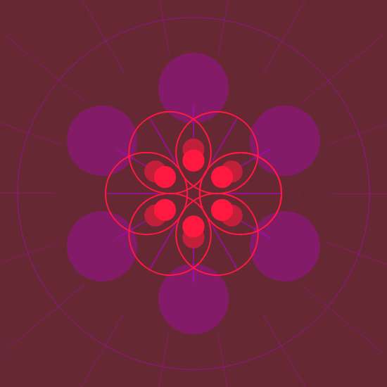
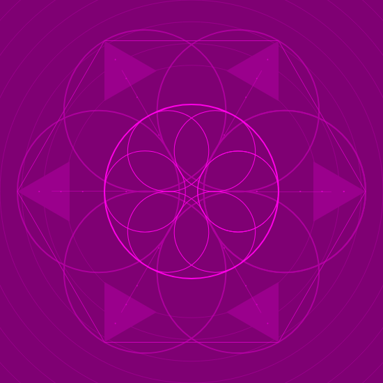

# Generative Design Project 

This is a quick experiment using some JavaScript libraries. The idea here was to build a fairly simple procedural generator of pattern art. 

## Output Examples 

Below you can see some outputs of this generator:

- Example 01  

- Example 02  

- Example 03  

## Libreries Used 

Below you will find a list of used libraries and it's main purpose in this project:

- **P5.js:** it emulates the Processing language to a JavaScript Syntax. This is the core library of the whole project

- **Caman.js:** it's a library for image manipulation. In this specific projects it's being used to layer different patterns

- **Materialize:** a simple frontend framework similar to Bootstrap. I used it just to set up the title and description of the project

## JavaScript Files Location

If you've never worked with Angular before, all the JavaScript files are located at [../src/assets/js/](../src/assets/js/)

## How to run it

The whole project was built using Angular to make future deploy easier. To run it you will need [Angular CLI](https://angular.io/guide/setup-local).

Navigate to the root of the project with your terminal and run:

`ng serve --open`

This will compile Angular and automatically open the browser at **localhost:4200**

